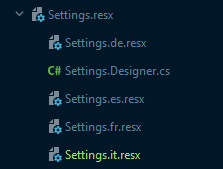
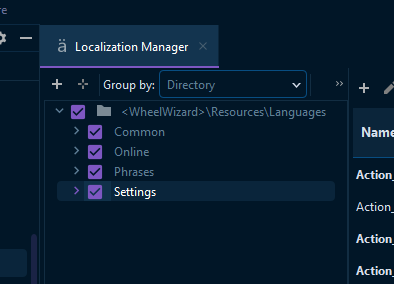

# Translations

This document outlines the everything there is to know about translations in this project.

## How to use translations

### In general
We split the translations into groups to organize them better. Still the groups are not perfect but we tried lol:
- `Common` - Contains translations that are used in multiple places/ across the board. Things like actions on buttons e.g. "cancel".
- `Online` - Contains translations that are directly related to the online parts of the applications, like friends, rooms, etc.
- `Phrases` - Contains translations that are basically full sentences or phrases.
- `Settings` - Contains translations that are related to settings, like the name of the setting, the description, etc.

We will maybe add more groups in the future but these are them for now.  
Note that you dont have to worry about if it will actually use the correct language. The system will automatically select the correct language based on the system language.

### C#
Start by using the following namespace `using WheelWizard.Resources.Languages;`
Then you can use any of the translations groups. and then simply the translation key. For example: `Common.Action_Cancle`

### XAML
Start by adding the following namespace `xmlns:lang="clr-namespace:WheelWizard.Resources.Languages"`  
Then you can use any of the translations groups. and then simply the translation key.  
For example: `Text="{x:Static lang:Common.Action_Cancle}"`

## Useful other info
The translations are stored in the `Resources/Languages` folder.  
Internally the actual language is selected by setting the culture:
```csharp
var newCulture = new CultureInfo("en");
CultureInfo.CurrentCulture = newCulture;
CultureInfo.CurrentUICulture = newCulture;
```
This will automatically select the correct language based on the system language.


## How to create a new group
Note that this process is from the perspective of a rider IDE. I assume that different IDEs are similar, but it may differ a bit.
1. Add a new Resource (.resx) file in the `Resources/Languages` folder. (PascalCase) 
2. When added, make this Resource file public. (Right-click -> Properties -> Custom Tool: `PublicResXFileCodeGenerator`)  
If you cant find it in the properties, you can also edit this manually in the `.csproj` file. The original value is `ResXFileCodeGenerator`
3. Add all the languages that are supported currently. Do this using the steps in the next section. "How to add a new language"
4. Add at least 1 new translation key to it so that the underlying class regenerates (This is necessary since we changed it from private to public in step 2, so it has to regenerate the class)

## How to create a new language
Note that this process is from the perspective of a rider IDE. I assume that different IDEs are similar, but it may differ a bit.
1. In the folder `Resources/Languages`, find the group you want to add the language to, drop down the group and check which 2 letter language code is missing.
2. In the folder `Resources/Languages` add a new Resource (.resx) file. Name this the same as the group you want to add the language to.  
However, also add the 2 letter language code at the end. so e.g. `Settings.it.resx` for Italian.
3. If you do this, you get something like this  
   I have no idea if this the same in all the other IDEs, but this is how it looks in Rider.  
   
4. You can remove teh `xx.yy.Desinger.cs` file hanging under it. This is not needed.
5. Then to stay organized, you can move the file on to its corresponding .resx file so that it is grouped together, so you would get:   


## How to update the translations with the spreadsheet
Note that this process is from the perspective of a rider IDE. I hope its the same for other editors, otherwise, you have to figure it out yourself lol.
### Update the translations in the app
1. Go to the spreadsheet, and then to the WheelWizard tab.
2. Click on the "File" menu, and then "Download" -> "Comma-separated values (.csv, current sheet)"
3. Open the file and remove the first/header row (that row contains percentages and stuff, that is for the spreadsheet only, not for the import)
4. In Rider, open the .resx file and make sure all the groups are checked so you can all updated them at once   

5. Then at the top, press `Import from CSV` and select the file you just downloaded & edited. (dont worry, it will only override values that are filled in in the csv file)
6. Dont forget to manually go to the `Settings.CompletePercentage` translation key, and set the percentage values to the correct values.
### Update the translations in the spreadsheet
1. Whenever you want to update the translations in the spreadsheet, you first need to update them in the app to make sure you have the latest translations.
2. In Rider, open the .resx file and make sure all the groups are checked so you can all export them at once (same as step 4 from above lol)  
   
3. Then press `Export to CSV` and save the file.
4. Go to the spreadsheet, and then to the WheelWizard tab.
5. IMPORTANT: Click cell `A2` in the spreadsheet, then press Import and upload this file. Then select `Replace data at selected cell`  
   And separate the columns by `comma`
6. Go down the list that you imported, and remove the `CompletePercentage` row, And go to the languages names and remove any languages row that contains `Og` at the end of th language key.